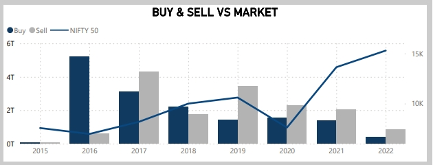

# Insider Trading Analysis (NSE)

## Introduction

This project analyzes insider trading activities on the National Stock Exchange (NSE) using **Power BI** for data visualization and **Power Query** for data preprocessing. It investigates insider trading patterns, their impact on stock prices, and correlations between insider actions and market movements.

## Data Source

- Data was extracted from the **NSE database**, focusing on insider buying, selling, and pledging activities.

## Tools Used

- **Power BI**: For creating interactive dashboards and visualizations.
- **Power Query**: For data preprocessing and cleaning.

## Graphs

The following graphs visualize key insights from the analysis:

  
*Insiders are contrarian to the broader market trends.*

  
*Insider Returns.*

  
*Analysis of insider activity and corporate events.*

  
*The copycat effect shows a relationship between insider volume and market volume.*

## Key Findings

- **Insiders are Contrarian**: Insiders' actions tend to go against the broader market trends.
- **CAGR of 18% (3% More than Market)**: Insiders achieved a **CAGR of 18%**, outperforming the market by 3%.
- **No Prior Information on Corporate Events**: Insider trades do not seem to be influenced by upcoming corporate events.
- **Copycat Effect**: An increase in insider trade volume leads to higher market volume, indicating a **copycat effect**.
